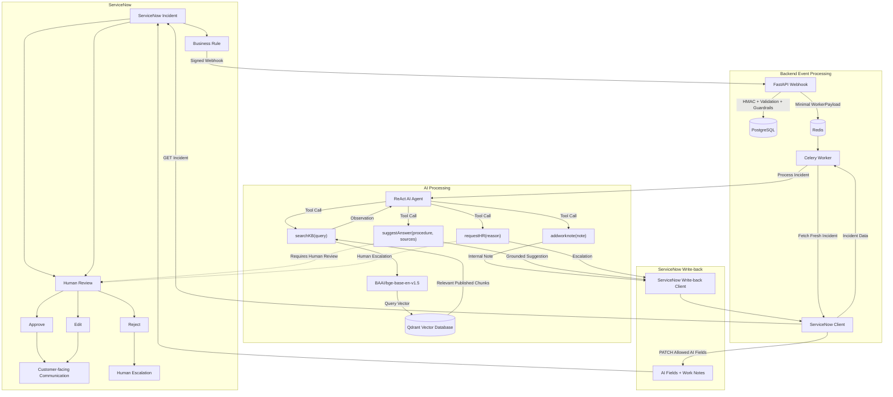
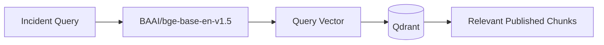
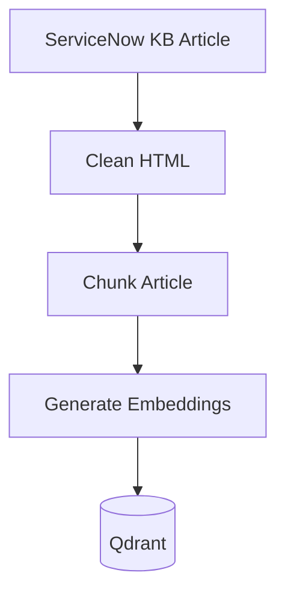
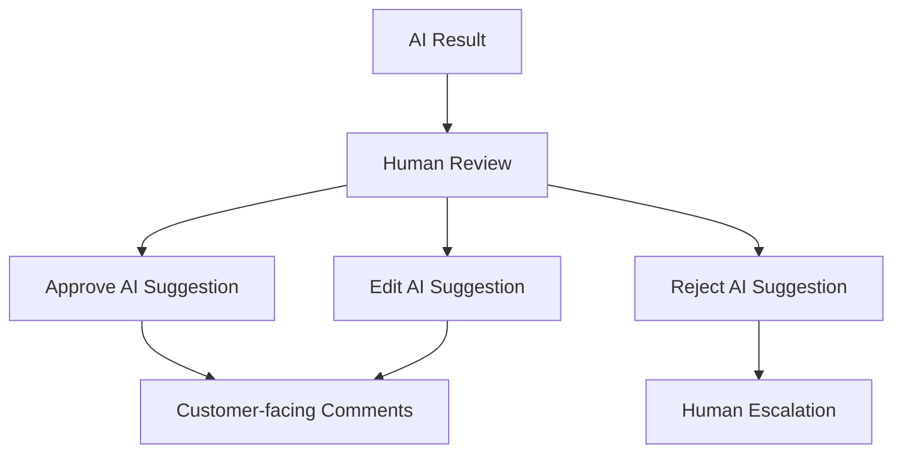
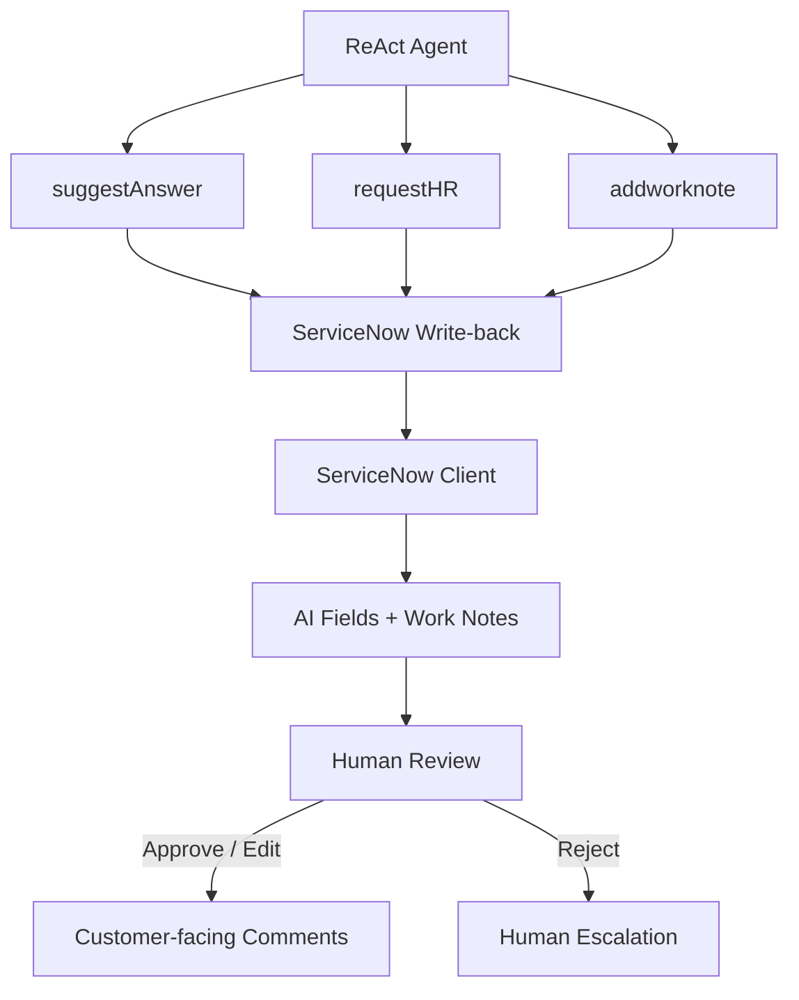
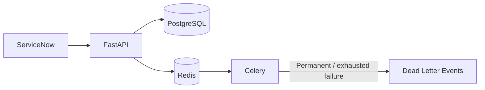
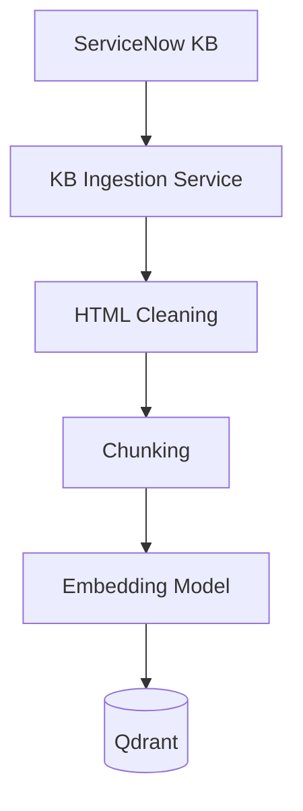

# System Architecture

## 1. Overview

The **AI ServiceNow Support Assistant** is an asynchronous AI support system that processes ServiceNow incidents, retrieves relevant knowledge-base content, generates a grounded response through a ReAct agent, and writes the result back to ServiceNow for human review.

The system is divided into several major components:

* ServiceNow
* ServiceNow Business Rule
* FastAPI API
* PostgreSQL
* Redis
* Celery Worker
* ServiceNow Client
* ReAct AI Agent
* Qdrant Vector Database
* ServiceNow Write-back Client
* Human Review workflow

The AI does not resolve, close, or reassign incidents. Customer-facing communication remains under human control.

---

## 2. High-Level Architecture



The architecture separates the system into five main stages:

1. **ServiceNow event generation** — the Business Rule sends a signed incident webhook.
2. **Asynchronous backend processing** — FastAPI validates and queues the event through PostgreSQL and Redis/Celery.
3. **AI reasoning and retrieval** — the Celery worker passes the fresh incident to the ReAct agent, which can use exactly four tools.
4. **Controlled ServiceNow write-back** — the tools communicate through the write-back layer and ServiceNow Client rather than directly modifying ServiceNow.
5. **Human review** — AI-generated suggestions or escalations are reviewed by a human before customer-facing communication.

The ReAct agent does not directly communicate with the ServiceNow API. Its tool calls are executed through the application's service and write-back layers.

The four agent tools are explicitly separated:

* `searchKB` retrieves grounding material from Qdrant.
* `addworknote` adds an internal work note.
* `suggestAnswer` produces a grounded response suggestion.
* `requestHR` escalates when the agent cannot safely produce a grounded response.

The final customer-facing response remains under human control.

---

## 3. End-to-End Incident Flow

### Step 1 — ServiceNow Incident

A ServiceNow incident is created or updated according to the configured ServiceNow-side Business Rule.

The Business Rule sends the incident information to the FastAPI webhook using a signed request.

The webhook payload contains:

* `sys_id`
* `number`
* `short_description`
* `description`

---

### Step 2 — FastAPI Webhook

The FastAPI application exposes:

```text
POST /api/webhook
```

The endpoint performs the initial processing before the incident is queued.

The main checks are:

1. Verify the HMAC-SHA256 signature.
2. Validate the incident payload.
3. Check incident idempotency.
4. Apply the initial guardrails.
5. Store the event state.
6. Queue a minimal worker payload.

The endpoint returns:

```text
202 Accepted
```

The AI processing is not performed inside the webhook request.

---

## 4. HMAC Verification

The webhook uses the `X-ServiceNow-Signature` header.

The request body is verified using the configured webhook secret and HMAC-SHA256.

Invalid or missing signatures are rejected before the incident enters the processing queue.

```text
ServiceNow
    |
    | Signed HTTP Request
    v
FastAPI
    |
    | Verify HMAC-SHA256
    v
Validated Webhook
```

---

## 5. Payload Validation and Guardrails

The incident payload is validated using the project schemas.

The initial guardrail layer performs checks such as:

* Truncating oversized text.
* Masking sensitive values such as IP addresses and credentials.
* Detecting suspicious prompt-injection keywords.
* Adding keyword tags.
* Wrapping incident content in an `<incident_data>` boundary.

Unsafe incidents are rejected instead of being queued for AI processing.

The worker performs the guardrails again after retrieving the fresh incident from ServiceNow.

---

## 6. Idempotency

Incident processing uses PostgreSQL to prevent duplicate processing.

The `events_log` table stores webhook events and uses the incident `sys_id` as the uniqueness key.

When the same incident is received again, the API can detect the duplicate and return:

```json
{
  "status": "duplicate_ignored"
}
```

This prevents the same incident from being queued repeatedly.

---

## 7. Asynchronous Processing

After validation, the webhook creates a minimal `WorkerPayload`.

The payload contains:

* `event_id`
* `sys_id`
* `number`
* `received_at`

The complete incident description is not placed in the queue payload.

The payload is submitted to Celery through Redis.

```text
FastAPI
   |
   v
Redis
   |
   v
Celery Worker
```

This separates webhook acknowledgement from the potentially slower AI processing pipeline.

---

## 8. Celery Worker

The Celery worker receives the queued event and performs the actual incident processing.

The worker:

1. Receives the `WorkerPayload`.
2. Checks whether the event was already completed.
3. Fetches the latest incident through the ServiceNow Client.
4. Applies the guardrails again.
5. Passes the incident to the processing pipeline.
6. Runs the ReAct agent.
7. Writes the resulting state back to ServiceNow through the ServiceNow Client.
8. Records completion or failure.

The worker is configured for reliable task processing, including late acknowledgements, worker-loss rejection, bounded prefetching, retry handling, and a visibility timeout.

---

## 9. ServiceNow Client

The ServiceNow Client is responsible for communication between the backend processing pipeline and ServiceNow APIs.

It separates ServiceNow API operations from the Celery worker and AI agent.

The client is used for:

* Fetching the latest incident.
* Writing permitted AI-controlled fields.
* Adding internal work notes.
* Handling ServiceNow API responses.
* Retrying transient ServiceNow failures.

The general flow is:

```text
Celery Worker
      |
      v
ServiceNow Client
      |
      +---- GET Incident ----> ServiceNow
      |
      +---- PATCH AI Fields -> ServiceNow
      |
      +---- Work Note -------> ServiceNow
```

The AI agent does not communicate directly with the ServiceNow API.

---

## 10. Fresh Incident Retrieval

The worker does not rely on the incident text that was received by the webhook.

Instead, it uses the incident `sys_id` to retrieve the current incident from ServiceNow through the ServiceNow Client.

This allows the processing pipeline to work with the latest available incident state.

The worker distinguishes between transient and permanent ServiceNow failures.

Transient failures such as network errors, HTTP `429`, and HTTP `5xx` responses can be retried.

Other `4xx` responses are treated as permanent failures and are sent to the dead-letter flow.

---

# 11. ReAct AI Agent

The incident is passed to the project's custom ReAct agent.

The agent uses a tool-based reasoning loop implemented with LangChain's `bind_tools`.

The agent has four available tools:

```text
searchKB
addworknote
suggestAnswer
requestHR
```

The agent decides which tools to call based on the incident and the retrieved knowledge.

The agent is constrained by execution limits including:

* Maximum iterations
* Maximum execution time
* Maximum token usage
* Maximum number of knowledge-base searches
* Prevention of repeated searches
* Grounding rejection limits

The LLM is responsible for producing tool calls, while the agent runtime executes the selected tools and returns their results to the LLM.

The ReAct loop can be summarized as:

```text
Incident
   |
   v
ReAct Agent
   |
   +---- searchKB ------> Qdrant
   |                       |
   |<------ Observation ---+
   |
   +---- addworknote ----> Write-back
   |
   +---- suggestAnswer --> Write-back
   |
   +---- requestHR ------> Write-back
   |
   v
Next reasoning step
```

The agent can continue reasoning after a tool observation, subject to its configured iteration, time, token, search, and grounding limits.

---

## 12. Knowledge Base Retrieval

The `searchKB` tool retrieves relevant published knowledge-base content.

The retrieval pipeline is:



The knowledge-base articles are processed during ingestion:



The project uses:

```text
Embedding model: BAAI/bge-base-en-v1.5
Vector size: 768
Default TOP_K: 5
Default score threshold: 0.70
```

Only published knowledge-base content is eligible for retrieval.

---

## 13. Agent Tools

### `searchKB(query)`

Searches the vector knowledge base for relevant published KB content.

The tool generates an embedding for the query and searches Qdrant.

The returned results provide the grounding material used by the agent.

The tool is the agent's main knowledge-retrieval mechanism.

---

### `addworknote(note)`

Adds an internal AI work note to the ServiceNow incident.

This is intended for internal incident processing information and is not the same as customer-facing communication.

Work notes remain internal to the ServiceNow support workflow.

---

### `suggestAnswer(procedure, sources)`

Submits a grounded response suggestion when the agent has sufficient knowledge.

The response must be supported by retrieved sources.

The write-back marks the incident as requiring human review.

The suggestion is not automatically sent to the customer.

---

### `requestHR(reason)`

Escalates the incident to a human when the AI cannot safely produce a grounded answer.

Examples include:

* Insufficient relevant KB results.
* Repeated grounding failures.
* LLM processing failure.
* Other conditions where safe automated response generation cannot continue.

---

## 14. Grounding and Citation Validation

The agent is designed to avoid generating unsupported responses.

A response must be grounded in retrieved knowledge-base content.

If the agent attempts to submit a response without sufficient grounding or citation support, the suggestion can be rejected and the agent can continue according to its configured limits.

After the configured grounding rejection limit is reached, the incident can be escalated through `requestHR`.

The system does not treat retrieval similarity as proof that an answer is correct. Retrieved KB content must provide sufficient supporting evidence for the proposed response.

The grounding flow can be summarized as:

```text
Agent
  |
  v
searchKB
  |
  v
Retrieved KB Chunks
  |
  v
Grounding Validation
  |
  +---- Sufficient ----> suggestAnswer
  |
  +---- Insufficient --> Continue Search / Reasoning
                              |
                              v
                       requestHR if limits reached
```

---

## 15. ServiceNow Write-back

The AI result is written back to ServiceNow through the ServiceNow Client and write-back layer.

The write-back uses an explicit allow-list of AI-controlled fields.

The main fields include:

* AI status
* AI confidence
* AI suggested response
* Human review required
* AI processed
* Internal work notes

The AI write-back intentionally does not control incident fields such as:

* State
* Assigned user
* Assignment group
* Close code
* Close notes

This keeps incident lifecycle and ownership under human/ServiceNow control.

The write-back path is:

```text
ReAct Agent
     |
     v
Agent Tool
     |
     v
ServiceNow Write-back Client
     |
     v
ServiceNow Client
     |
     v
ServiceNow AI Fields / Work Notes
```

---

## 16. Human Review

After the AI writes a suggestion or escalation state, the incident is reviewed by a human fulfiller.

The ServiceNow review workflow provides three actions:

```text
Approve AI Suggestion
Edit AI Suggestion
Reject AI Suggestion
```

### Approve

The fulfiller approves the AI suggestion and it is copied to the customer-facing `comments` field.

### Edit

The fulfiller can modify the suggested response before using it as customer-facing communication.

### Reject

The AI suggestion is rejected and the incident is moved into the configured human-escalation flow.

The AI itself does not directly write customer-facing comments.

The review flow is:



---

## 17. Write-back Architecture



The write-back operation is designed as an atomic update for the AI-controlled fields.

Transient ServiceNow write failures can be retried.

The write-back client uses a restricted field allow-list so the AI cannot modify protected incident lifecycle fields.

Customer-facing comments are intentionally outside the AI write-back allow-list and are controlled by the human review workflow.

---

## 18. Security Architecture

Security controls exist at multiple layers.

### Webhook Layer

```text
ServiceNow
    |
    v
HMAC Signature
    |
    v
FastAPI
```

The webhook validates the request signature before accepting the event.

### Input Layer

The system validates and sanitizes incident content before AI processing.

### Agent Layer

The agent applies prompt-injection checks, grounding requirements, and execution limits.

### Write-back Layer

The ServiceNow write-back client restricts AI modifications to an explicit allow-list.

### Human Review Layer

Customer-facing communication requires human review.

The combined security boundary is:

```text
ServiceNow
    |
    v
Signed Webhook
    |
    v
FastAPI Validation
    |
    v
Input Guardrails
    |
    v
ReAct Agent Limits + Grounding
    |
    v
Restricted Write-back
    |
    v
Human Review
```

---

## 19. Reliability Architecture

The processing pipeline separates event reception from AI execution.



The system supports:

* PostgreSQL event tracking
* Idempotency
* Redis queue decoupling
* Celery asynchronous processing
* Late task acknowledgement
* Worker-loss rejection
* Retry handling
* Dead-letter handling
* Bounded agent execution
* Transient write-back retries

This architecture prevents the ServiceNow webhook request from remaining open while the AI performs retrieval and reasoning.

---

## 20. Knowledge Base Ingestion Architecture

Knowledge-base ingestion is separate from incident processing.

The ingestion pipeline is:



Published ServiceNow knowledge articles are cleaned, chunked, embedded, and stored in Qdrant.

During incident processing, the same embedding model is used to convert the search query into a vector before searching Qdrant.

The ingestion and retrieval paths are therefore connected through the same embedding model and Qdrant collection:

```text
ServiceNow KB
     |
     v
Cleaning
     |
     v
Chunking
     |
     v
BGE Embeddings
     |
     v
Qdrant
     ^
     |
BGE Embedding
     ^
     |
Agent searchKB Query
```

---

## 21. Complete Processing Sequence

The complete incident lifecycle can be summarized as:

```text
1. ServiceNow creates/updates an incident
                    |
                    v
2. Business Rule sends signed webhook
                    |
                    v
3. FastAPI verifies signature
                    |
                    v
4. Payload validation + guardrails
                    |
                    v
5. PostgreSQL idempotency check
                    |
                    v
6. Minimal event queued in Redis
                    |
                    v
7. Celery worker receives event
                    |
                    v
8. Worker uses ServiceNow Client
   to fetch fresh incident
                    |
                    v
9. Guardrails run again
                    |
                    v
10. ReAct agent starts
                    |
                    v
11. searchKB retrieves published KB content
                    |
                    v
12. Agent evaluates grounding
                    |
              +-----+-----+
              |           |
              v           v
        Sufficient    Insufficient
        knowledge     knowledge
              |           |
              v           v
       suggestAnswer   Continue reasoning
              |           |
              |           v
              |       requestHR
              |           |
              +-----+-----+
                    |
                    v
13. ServiceNow write-back
                    |
                    v
14. Human review
                    |
              +-----+-----+
              |     |     |
              v     v     v
           Approve Edit Reject
              |     |     |
              +-----+-----+
                    |
                    v
15. Customer-facing response
    or human escalation
```

The important architectural boundary is that the AI processing stage ends with a controlled ServiceNow state update. The final customer-facing action remains a human decision.

---

## 22. Component Responsibilities

| Component         | Responsibility                                                                                     |
| ----------------- | -------------------------------------------------------------------------------------------------- |
| ServiceNow        | Source of incidents and KB articles; receives AI results and provides human review                 |
| Business Rule     | Sends signed incident events to the backend                                                        |
| FastAPI           | Receives webhooks, validates requests, applies initial guardrails, records events, and queues work |
| PostgreSQL        | Tracks webhook/event state, completed events, and dead-letter events                               |
| Redis             | Acts as the Celery message broker/backend                                                          |
| Celery Worker     | Performs asynchronous incident processing                                                          |
| ServiceNow Client | Retrieves fresh incidents and communicates with ServiceNow APIs                                    |
| ReAct Agent       | Controls AI reasoning and tool usage                                                               |
| `searchKB`        | Retrieves relevant published KB content                                                            |
| `addworknote`     | Adds internal AI notes                                                                             |
| `suggestAnswer`   | Produces a grounded response for human approval                                                    |
| `requestHR`       | Escalates the incident to a human                                                                  |
| Qdrant            | Stores and retrieves KB vectors                                                                    |
| BGE Embeddings    | Converts KB content and search queries into vectors                                                |
| Write-back Client | Coordinates permitted AI fields and work note updates                                              |
| Human Review      | Controls customer-facing communication                                                             |

---

## 23. Architecture Boundaries

The architecture intentionally separates several responsibilities.

### Event Reception

FastAPI is responsible for receiving and validating ServiceNow events.

### Background Processing

Celery is responsible for long-running incident processing.

### ServiceNow Communication

The ServiceNow Client is responsible for retrieving incidents and communicating with ServiceNow APIs.

### Knowledge Retrieval

Qdrant and the embedding model are responsible for semantic KB retrieval.

### Reasoning

The ReAct agent decides how to use the available tools.

### ServiceNow Updates

The write-back layer controls the fields that the AI is allowed to modify.

### Customer Communication

Human review controls the final customer-facing response.

This separation keeps the webhook path fast, keeps AI processing asynchronous, and prevents the AI agent from directly controlling incident lifecycle actions.
